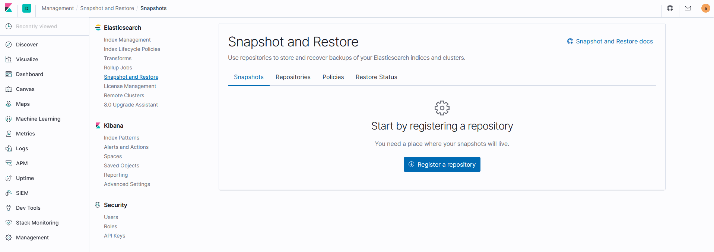
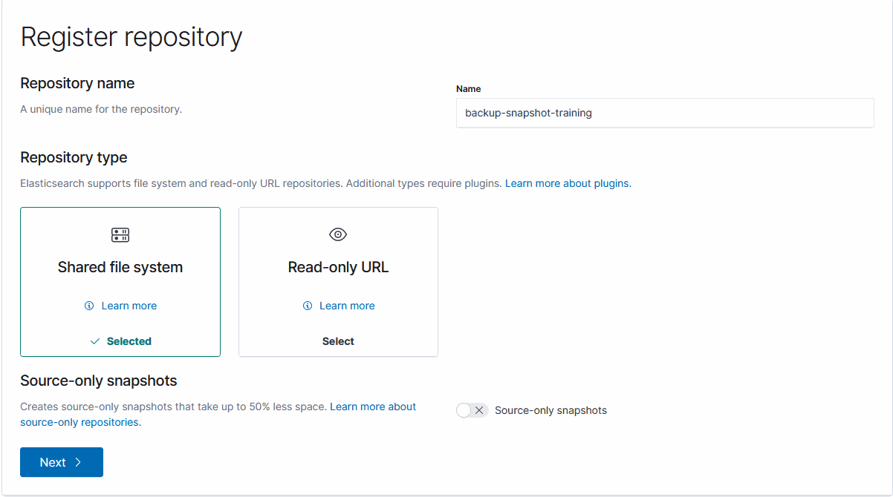
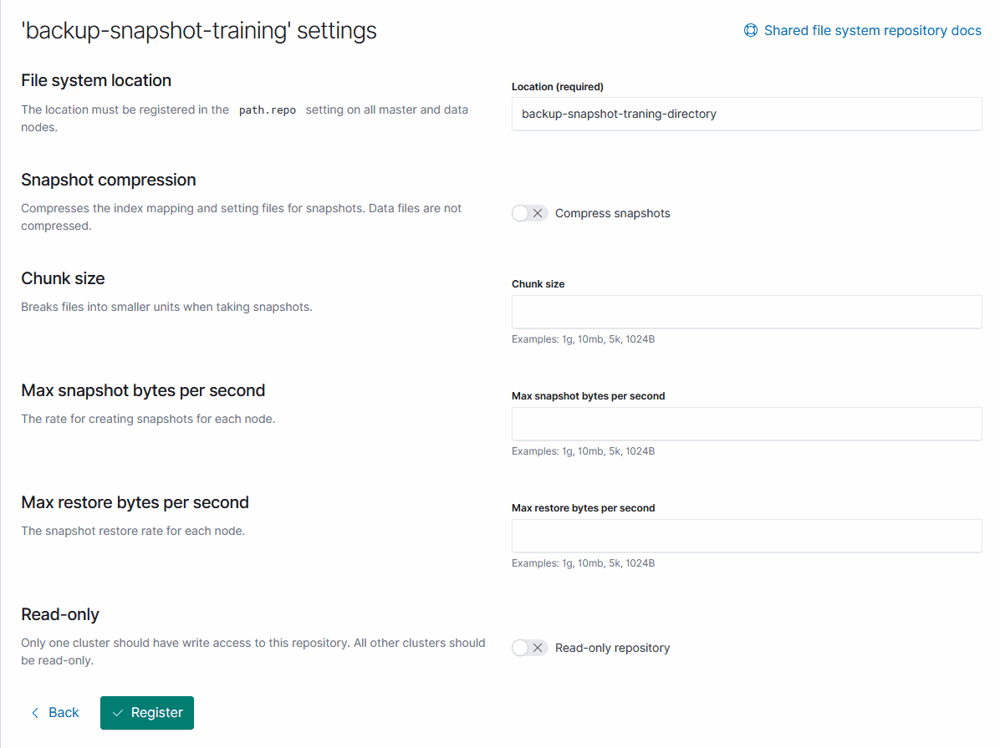
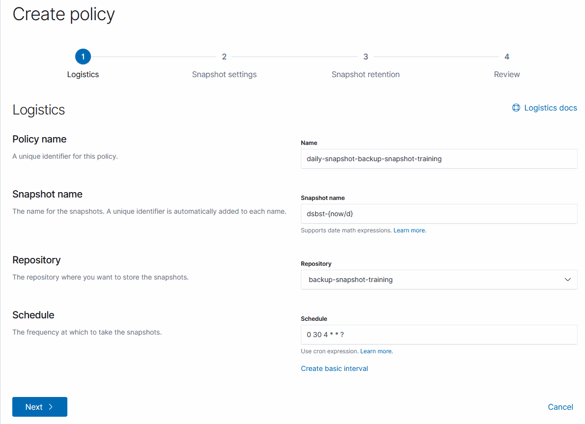
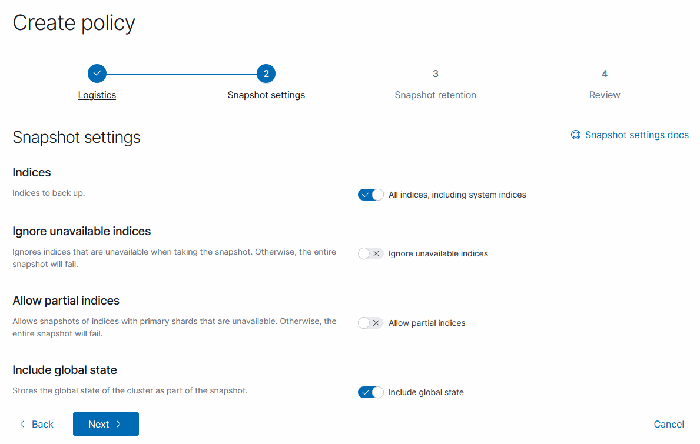
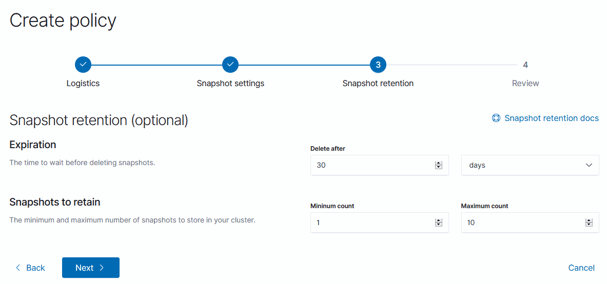
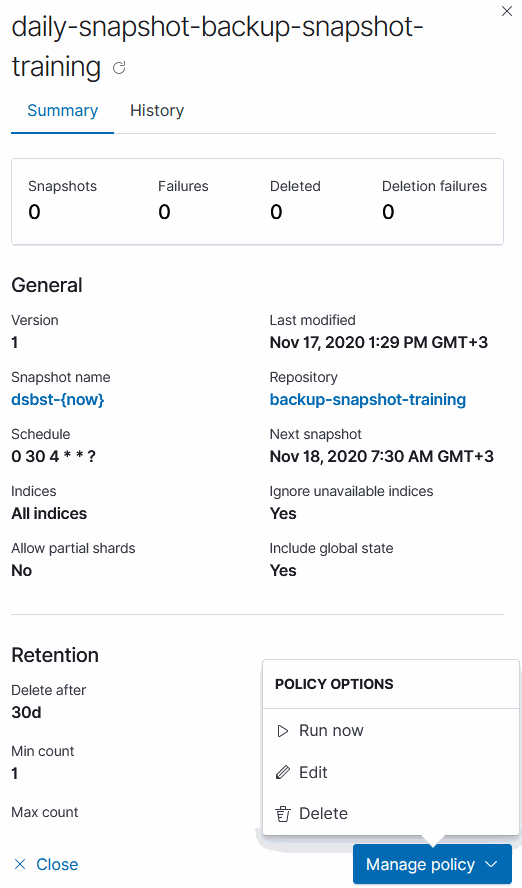

Yazıyı İngilizce okumak için [tıklayınız.](https://dev.to/kemalkolcuoglu/elasticsearch-snapshots-feature-2m81)

Snaphshot Elasticsearch'ün Basic Plan ile birlikte gelen özelliklerinden birisidir. (Kullanımı Ücretsizdir)

Snapshot'ları Kibana UI, Elasticsearch SLM API ya da kendi geliştirdiğimiz scriptler ile oluşturabiliriz. Bu makalede Kibana UI kullanarak nasıl Snapshot ile yedekleme sürecini nasıl başlatabileceğimizden bahsedeceğim.

**ÖNEMLi!**
- Elasticsearch 6.x sürümünde oluşturulmuş bir snapshot 7.x sürümünde kullanılabilir.
- Elasticsearch 5.x sürümünde oluşturulmuş bir snapshot 6.x sürümünde kullanılabilir.
- Elasticsearch 2.x sürümünde oluşturulmuş bir snapshot 5.x sürümünde kullanılabilir.
- Elasticsearch 1.x sürümünde oluşturulmuş bir snapshot 2.x sürümünde kullanılabilir.

Kibana üzerinde snapshotlara erişebilir, yönetebilir ve yeniden yapılandırabiliriz. Bu işlemleri 'Management' > 'Snapshot and Restore' kısmından gerçekleştirebiliriz.



Snapshot sürecini başlatmadan önce bir respository oluşturmamız gerekmektedir. Repository oluşturmak için Kibana üzerinde 'Repositories' sekmesine tıklayarak burada 'Register a repository' butonuna tıklayalım. Butona tıkladıktan sonra karşımıza aşağıdaki ekran gelecektir.



## **Repository Türleri:**

- **Shared File System:** Bu seçenek makinemiz dosya sistemini kullanarak snapshot dosyalarını bu dosya sistemi üzerinde oluşturur.

- **Read-only URL:** Bu seçenek snapshot dosyalarının barındırılabilmesi için bir URL (http/https/ftp/file) istemektedir. Bu URL AWS, Azure, Google Cloud gibi sistemlerdeki makinelerimiz olabilir veya bir git repository'si tanımlanabilir.

> Ayrıca Elasticsearch bize bu kısımda daha etkili kullanım için AWS, Azure gibi bulut sistemleri için özelleşmiş eklentiler sunmaktadır.

### Shared File System:



**Parametreler:**

- **File System Location (Zorunlu):** Bu parametre bizden bir dizin adı istemektedir. Snapshot dosyaları bu dizin içerisine yazılacaktır.

- **Snapshot Compression:** Anlık görüntü dosyalarının sıkıştırılmasını sağlar. Sıkıştırma yalnızca meta veri dosyalarına uygulanır (dizin eşleme ve ayarlar). Veri dosyaları sıkıştırılmaz. Bu sayede snapshot dosyaları daha nispeten daha az yer kaplar. Varsayılan değeri `true`dur.

- **Chunk Size:** Büyük dosyalar isteğe bağlı olarak gerekirse anlık görüntü alma sırasında parçalara bölünebilir. Yığın boyutunu birim olarak belirtiniz, örneğin 1GB, 10MB, 5KB, 500b gibi. Varsayılan değer `null` (sınırsız yığın boyutu).

- **Max Snapshot Bytes Per Second:** Düğüm başına kısma geri yükleme hızı. Varsayılan değeri saniyede 40MB'dır.

- **Max Restore Bytes Per Second:** Düğüm anlık görüntü hızı başına kısma sayısı. Varsayılan değeri saniyede 40MB'dır.

- **Read-Only:** Repository'i yalnızca okunabilir olarak belirler. Varsayılan değeri `false`dur

Gerekli yapılandırmalar tamamalandıktan sonra repository'miz oluşturulur. Ancak bu yalnızca Snapshot sürecinin başlangıcıdır. Sürecin devamında snapshotların nasıl oluşturulacağını belirlediğimiz 'Policy'leri oluşturmamız gerekmektedir.

## **Create a Policy:**

Policy'ler (Kural, Politika, Prosedür) biraz önce bahsettiğim gibi snapshot'ların nasıl oluşturulacağını belirlediğimiz kurallar dizinidir. Ayarladığımız seçeneklere göre dosyalar oluşturulacaktır.



**Parametreler - 1. Kısım:**

- **Policy Name (Zorunlu):** Policy için eşsiz bir ad tanımlaması.

- **Snapshot Name (Zorunlu):** Tanımlanan değer otomatik olarak herbir snapshot dosyasının adına eklenir. Bu değer, dizin adlarında desteklenen tarih matematiğinin aynısını destekler. Çakışan snapshot adlarını önlemek için, her snapshot adına otomatik olarak bir UUID eklenir.

- **Repository (Zorunlu):** Bu Policy tarafından oluşturulan snapshot'ların depolacağı repository'i belirler.

- **Schedule (Zorunlu):** Policy'lerin snapshot oluşturma ve süresi dolmuş snapshot'ların silinmesi için tanımlanmış periyodik veya zamandır. Mevcut ilkelerde zamanlama değişiklikleri hemen uygulanır.



**Parametreler - 2. Kısım:**

- **Indices:** Snapshot'lara dahil edilen dizin adları dizisi veya dizin adlarının joker karakter modeli.

- **Ignore Unavailable Indices:** Eğer değer `true` olarak tanımlanırsa, eksik dizinler snapshot oluşturmanın başarısız olmasına ve hata döndürmesini sağlar. Varsayılan değeri `false`dır.

- **Allow Partial Indices:** Kullanılamayan shard'lara sahip dizinlerin Snapshot oluşturmasıa izin verir. Aksi takdirde, snapshot oluşturma işlemi başarısız olur.

- **Include Global State:** Eğer değer `true` olarak tanımlanırsa, Cluster bilgileri Snapshot'a eklenir. Varsayılan değeri `false`dır.



**Parametreler - 3. Kısım:**

- **Expiration:** Bir snapshot'ın süresinin dolduğu ve silinmeye uygun olduğu kabul edilen süre.

- **Snapshots to Retain:**
    - **Minimum Count:** Süresi dolmuş olsa bile saklanacak minimum snapshot sayısı.
    - **Maximum Count:** Süresi henüz dolmamış olsa bile saklanacak maksimum snapshot sayısı. Repository'de snapshot sayısı bu sınırı aşarsa, en son oluşturlan snapshot'lar saklanır ve eskileri silinir.

Yapılandırmaları tamamladıktan sonra Kibana bize oluşturmuş olduğumuz Policy'nin Request halini paylaşmaktadır. Kibana üzerinde yer alan Dev-Tool'da, curl yada herhangi bir programlama dilinde bu request kullanılabilir. Bu örnek için oluşturduğumuz Policy'nin Request hali aşağıdaki gibidir.

``` json
PUT _slm/policy/daily-snapshot-backup-snapshot-training
{
  "name": "dsbst-{now}",
  "schedule": "0 30 4 * * ?",
  "repository": "backup-snapshot-training",
  "config": {
    "ignore_unavailable": true
  },
  "retention": {
    "expire_after": "30d",
    "min_count": 1,
    "max_count": 10
  }
}
```

Sonunda gerekli bütün adımlar tamamlandı! Policy'de tanımladığımız zaman geldiğinde Elasticsearch Snapshot oluşturmayı başlatacaktır.



Ayrıca istediğimiz zaman Policy'i elle tetikleyerek Snapshot oluşturmayı başlatabiliriz.

---

Bu öğreticide sizlere Elasticsearch üzerinde yedekleme yapmak için en çok kullanılan ve bizzat Elasticsearch'ün tavsiye ettiği bir yöntem olan Snapshot hakkında sade bilgi vermeyi amaçladım. Sorularınız için sosyal medya ve e-posta yoluyla bana ulaşabilirsiniz.

Yazılımla Kalın :blush:

## Kaynakça

- [Elasticsearch Docs - Snapshot Register Repository](https://www.elastic.co/guide/en/elasticsearch/reference/7.6/snapshots-register-repository.html)

- [Elasticsearch Docs - SLM API PUT Policy](https://www.elastic.co/guide/en/elasticsearch/reference/7.6/slm-api-put-policy.html)

- [Elasticsearch Docs - Repository](https://www.elastic.co/guide/en/elasticsearch/plugins/7.6/repository.html)

- [Elasticsearch Docs - Snapshots, Take Snapshot](https://www.elastic.co/guide/en/elasticsearch/reference/current/snapshots-take-snapshot.html)
