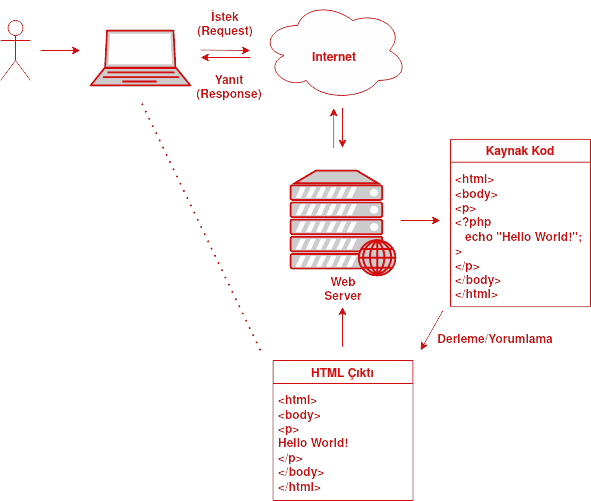
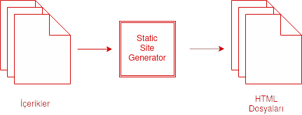
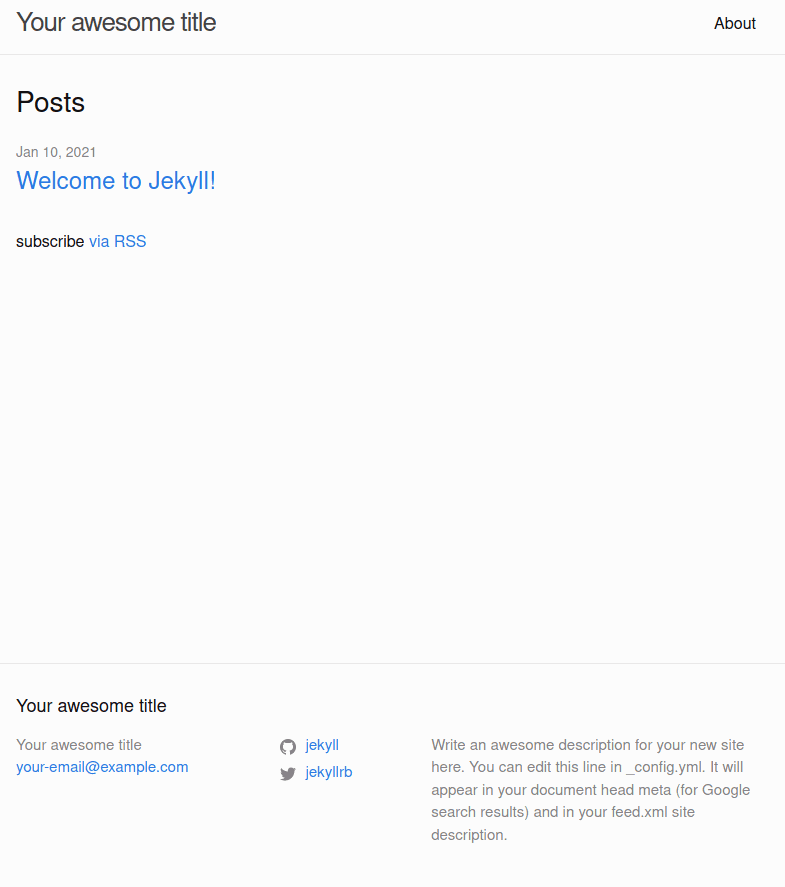
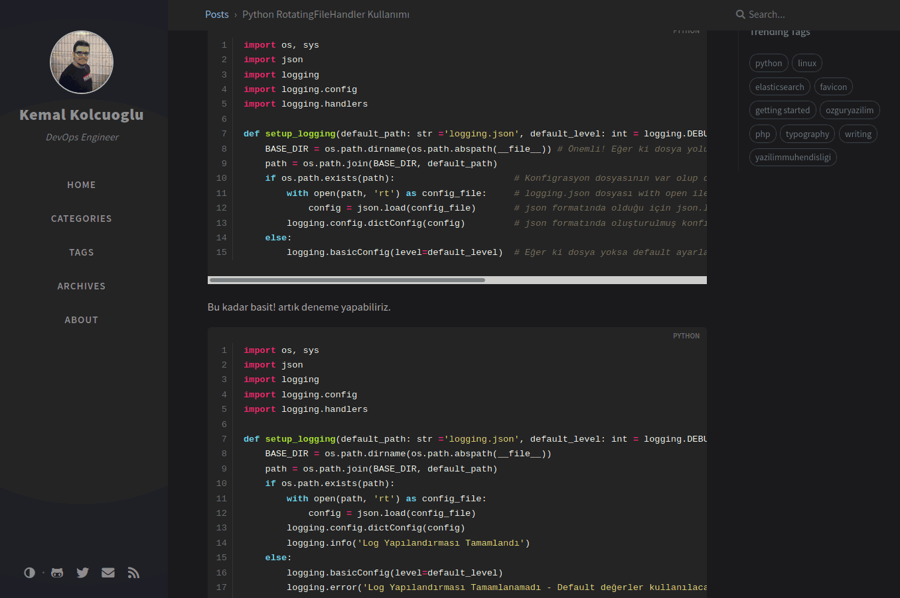

Jekyll Ruby Programlama Dili ile geliştirmiş, Açık Kaynak bir Statik Site Oluşturucu'dur (Static Site Generator). Jekyll ile hızlıca web sitesi oluşturabilir ve yayınlayabilirsiniz.

Elbette her sorunu çözen sihir bir değnek olmakdığı hatırlamamız gerekli. Jekyll ağırlı olarak; blog, cv, iletişim sitesi, etkinlik sitesi, dökümantasyon sitesi gibi içeriğin webadmin tarafından oluşturulduğu ve kullanıcıyla daha az etkileşime girildiği web siteleri için etklidir. Ne yazık ki Jekyll ile bir e-ticaret sitesi geliştiremezsiniz. Bunun sebebi ise onun bir Static Site Generator olmasındandır.

## Static Site Generator Nedir?

Bu kavramın ne olduğunu anlayabilmek için öncelikle web siteleri nasıl bir yapıya sahip olduğunu anlamız gerekli.

### Client-Server Mimarisi

Elbette birçok web mimarisi olmasına rağmen geçmişten günümüze en çok kullanılan (WWW'de %70'den fazla) mimari Client-Server Mimarisidir.

Bir web sitesinin ön-uç (front-end) öğeleri HTML, CSS ve JavaScript ile oluşturulur. Web sitesinin ise sunucuda mantıksal işlemleri gerçekleştirdiği arka-uç (back-end) kısmı ise C#, Java PHP, Python vb. diller ile geliştirilir. Kullanıcı browser üzerinden websitesine istekte bulunduğunda bu işlem web sitesinin barındığı sunucuya ulaşır ve Arka-uç'ta veritabanından veri çekilmesi, eğer ki üzerinde mantıksal işlemler yapılacaksa bunların gerçekleştirilmesi ve son olarak verinin son halinin HTML'e uyarlanması ve yazılması gerçekleşir. Web sitesinin barındığı sunucu oluşturulan HTML çıktılarını kullanıcının browser'ına gönderiri. Bu şekilde kullanıcının browserdan göndermiş olduğu istek (Request) yanıtlanmış (Response) olur.



En kaba haliyle Client-Server mimarisi bu şekilde çalışmaktadır.

### 'Statik' Kavramı

Client-Server Mimarisinde back-end diller ile geliştirilen web sitemiz bize yanıt döndürürken bir HTML çıktısı oluşturulduğundan söz etmiştik. Bu durumda oluşturulmuş olan HTML çıktısı bir statik dosyadır, tıpkı bir pdf dosyası gibi. Yani 'statik' kavramı oluşturulan dosyanın içerisinde herhangi bir server-side programa diline ait kod satırları bulunmamakta ve çalışmamaktadır.

> **Dikkat!** Bu kısım JavaScript gibi Client-Side bir dil için değil; PHP, Java gibi Server-Side diller için geçerlidir. Bir HTML dosyasının içerisinde JavaScript diline ait kodlar bulunabilir. Ancak bu kodlar HTML dosyasının kendisi tarafından değil, browser tarafından çalıştırılır. Bu yüzden HTML dosyası bir Statik dosyadır.

### Static Web Site

Elbette her web sitesinin Server-Side işlemlere ihtiyacı yoktur. Özellikle Web'in daha yeni ortaya çıktığı yıllarda web siteleri yalnızca HTML dosyalarından oluşuyordu. Kullanıcıya doğrudan sunucu tarafından HTML dosyası döndürülüyordu ve arkada hiçbir back-end dili çalışmıyordu.

Statik web sitelerinin çok büyük avantajları vardır. Yalnızca daha önce oluşturulmuş bir HTML dosyası sunucu tarafından döndürüldüğü için back-end dillerini kullanmaya gerek kalmaz ve bu sayede istek çok daha hızlı yanıtlanır. Aynı zamanda kullanıcıyla etkilişim olmadığı için çok daha güvenli web siteleridir.

### Static Site Generator

Static Site Generator'lerin amacı; geliştiricinin web sitesinde görüntülecek içeriği generatör tarafından belirlenmiş bir markup dili formatında oluşturması ve bunların otomatik olarak HTML dosyalarına dönüştürülerek tamamen statik içeriği kullanıcıya sunmaktır.

Jekyll gibi farklı dillerde gelişirilmiş yüzlerce Static Site Generator mevcuttur. Meraklıları [bu sayfaya](https://jamstack.org/generators/) göz atabilir :blush:



## Jekyll - Static Site Generator

Jekyll en başta bahsettiğimiz gibi Ruby programlama dile geliştirilmiş bir Static Site Generator. Ancak korkmanız gerek yok. Jekyll kullanırken Ruby dili bilmenize gerek yoktur. Yalnızca bazı yazım kurallarını bilmeniz sizin için yeterlidir.

Bu öğreticide Jekyll ile nasıl web sitesi oluşturulacağını inceleyeceğiz.

### Jekyll Kullanımı İçin Ön Bilgi

Jekyll belli kurallara sahiptir ve bu kurallarla birlikte geliştirmeler yapılır.

Bilinmesi Gerekenler;

- **Markdown:** Bir markup dilidir. Şuan okumuş olduğunuz bu blog yazısı markdown dilinde yazılmış ve HTML'e dönüştürülerek sizlere sunulmuştur. HTML'e oranla çok daha kolay yazılabilen ve okunabilen bir markup dilidir. Jekyll'de içeriklerinizi markdown dosyası olarak oluşturmanız gerekmektedir. Uzantısı `.markdown` ya da `.md`dir. Ayrıca markdown içerisine HTML kodları eklenebilir. Bu sayede çok daha güzel görünümlü içerikler elde edilebilir.

> Daha detaylı bilgi için -> [Markdown Guide](https://www.markdownguide.org/)

- **YAML:** Bir başka markup dilidir. Jekyll bu dili `_config.yml` dosyasında içerikleri oluşturduğunuz markdown dosyalarında kullanmaktadır. Tıpkı markdown gibi kolay okunabilen ve yazılabilen bir yapıya sahiptir. Markdown dosyalarının içinde içeriklerin meta bilgilerini yazmak için kullanılır. Uzantısı `.yaml` ya da `.yml`dır.

> Daha detaylı bilgi için -> [YAML Guide](https://learnxinyminutes.com/docs/yaml/)

### Jekyll Kurulumu

**Gereksinimler**

- Ruby v2.4.0 ya da üstü

- RubyGems

- GCC and Make

Windows'da Ruby kurulu için en çok tercih edilen yol [RubyInstaller](https://rubyinstaller.org/) kullanmaktır. Eğer Windows kullanıyorsanız ve daha önce Ruby dili ilgilenmediyseniz RubyInstaller kullanmanızı öneririm. RubyGems'de RubyInstaller ile birlikte kurulacaktır.

Ruby ve RubyGems kurulumu tamamlandıktan sonra terminal ekranında aşağıda komutu çalıştırarak Jekyll kurulumunu tamamlayabilirsiniz.

`gem install jekyll bundler`

Daha detaylı kurulum bilgisi için lütfen [Jekyll Installation](https://jekyllrb.com/docs/installation/) sayfasına göz atınız.

### Jekyll Projesi Oluşturma ve Dosya Yapısı

Bütün kurulumlar sorunsuz olarak tamamlandıysa Jekyll projesini oluşturmaya başlayabilirsiniz. Kaynak kodları saklayacağız dizine gittikten sonra aşağıdaki komut ile jekyll projesi oluşturulacaktır.

`jekyll new myblog`

Burada yazan 'myblog' yerine istediğiniz herhangi bir adı verebilirsiniz. Ancak boşluk karakteri kullanmaktan kaçınınız. Onun yerine _ (alt tire) kullanabilirsiniz. Best practice olarak ad kısmınında küçük harfler kullanmanız tavsiye edilir.

Herhangi bir metin editörü ile projeyi açtığınızda aşağıdaki gibi bir dosya yapısı ile karşılaşacaksınız.

'Markdown' ya da 'md'

```
myblog
├── 404.html
├── about.markdown
├── _config.yml
├── Gemfile
├── Gemfile.lock
├── index.markdown
└── _posts
    └── 2021-01-10-welcome-to-jekyll.markdown
```

**Dosyalar ve Dizinler;**

- **404.html:** 404 hatası yaşandığı durumda kullanıcı tarafından görüntülecek dosyadır.

- **about.markdown:** By-Default oluşturulmuş 'about' sayfasının içeriğidir.

- **_config.yml:** Jekyll projesinin yapılandırma ayarlarının bulunduğu dosyadır.

- **index.markdown:** By-Default oluşturulmuş 'index' sayfasının içeriğidir. Projenizde 'index' dosyası bulunmanız tavsiye edilir. Eğer kullanmak istemiyorsanız _config.yml dosyası içerisindeki `baseurl` kısmına anasayfa olarak belirlemek istediğiniz sayfayı yazabilirsiniz.

- **_posts:** Bu dizin adı By-Default oluşturulmuştur. Dizinin adını değiştirebilir ya da bunun gibi yeni dizinler oluşturabilirsiniz. Bu dizinler kategori gibidir ve yazılarınızı bu dizin içerisine ekleyebilirisiniz. Bu sayede dizin içerisindeki yazılarınız bu dizine bağlanmış olur.

**'_config.yml' Dosyası**

Bu dosya jekyll projesinin global bilgilerini ve ayarlarını barındırır. Aşağıdaki çıktı oluşturmuş olduğumuz proje içerisinde By-Default olarak yazılan bilgilerdir. Bu dosya eklediğimiz pluginler, temalar ve daha bir çok bilgiyi içermektedir.

```yml
title: Your awesome title
email: your-email@example.com
description: >- # this means to ignore newlines until "baseurl:"
  Write an awesome description for your new site here. You can edit this
  line in _config.yml. It will appear in your document head meta (for
  Google search results) and in your feed.xml site description.
baseurl: "" # the subpath of your site, e.g. /blog
url: "" # the base hostname & protocol for your site, e.g. http://example.com
twitter_username: jekyllrb
github_username:  jekyll

# Build settings
theme: minima
plugins:
  - jekyll-feed
```

### Jekyll İle Statik Dosyaların Oluşturulması ve Deployment

Artık Jekyll'ın asıl olayı olan statik dosyaların oluşturulması kısmına geldik. Bunun için aşağıdaki komutları terminalde çalıştırarak statik dosyaların oluşturulmasını sağlayabilirsiniz.

``` bash
cd myblog
bundle install
bundle exec jekyll serve
```

Komutları çalıştırdıktan sonra 4000 portunda bir servis oluşturarak sitemizin oluşturulmuş halini görüntüleyebiliriz.



Aynı zamanda proje dizininde yeni eklemeler oldu. `_site` dizininde markdown dosyalarımız _config.yml dosyasındaki ayarlamıza göre HTML olarak oluşturuldu. Eğer ki web sitemizi canlıya almak istersek yalnızca '_site' dizininin altındaki dosyaları sunucuya yüklemek yeterli olacaktır. Bu sayede tamamen statik bir web sitesini kullanılara sunabiliriz.

## Jekyll İle Blog Sitesi Oluşturma

Bu yazımız hali hazırda oluşturulmuş bir jekyll projesini kullanarak nasıl bir blog sitesi oluşturulabileceğini göreceğiz.

[Jekyll Themes](http://jekyllthemes.org/) sayfasını kullanarak beğendiğiniz bir tema ile başlayabilirsiniz. Ben siyah tonda temaları sevdiğim için [Chirpy](http://jekyllthemes.org/themes/jekyll-theme-chirpy/) kullanmayı tercih ettim. Kaynak kodlar [MIT Lisansı](https://github.com/cotes2020/jekyll-theme-chirpy/blob/master/LICENSE) ile lisanslandığı için değiştirmekte ve kullanmakta tamamen özgürüz :blush:

Github sayfasından kaynak kodlarını indiriyoruz ve herhangi bir text editörü ile kodları açıyoruz.

```bash
git clone https://github.com/cotes2020/jekyll-theme-chirpy/
cd jekyll-theme-chirpy/
code .
```

Burada ilk yapmamız gereken `_config.yml` dosyası içerisindeki bilgileri değiştirmek. Tema geliştiricisi bizim için yorum satırları eklemiş ve geriye yalnızca uygun alanları doldurmak kalıyor.

``` yml
title: Kemal Kolcuoglu                          # the main title

tagline: DevOps Engineer   # it will display as the sub-title

description: >-                        # used by seo meta and the atom feed
  Kemal Kolcuoglu kişisel web sitesi ve teknik blog sayfası

# fill in the protocol & hostname for your site, e.g., 'https://username.github.io'
url: ''

author: Kemal Kolcuoglu                  # change to your full name

github:
  username: kemalkolcuoglu             # change to your github username

twitter:
  username: KemalKolcuoglu            # change to your twitter username

social:
  name: Kemal Kolcuoglu                  # it will shows as the copyright owner in Footer
  email: kemal@kolcuoglu.net             # change to your email address
  links:
    # The first element serves as the copyright owner's link
    - https://www.linkedin.com/in/kemalkolcuoglu35465325/
    - https://twitter.com/KemalKolcuoglu      # change to your twitter homepage
    - https://github.com/kemalkolcuoglu       # change to your github homepage
    - https://www.instagram.com/kemal_kolcuoglu/

baseurl: ''

# Change to your timezone › http://www.timezoneconverter.com/cgi-bin/findzone/findzone
timezone: Europe/Istanbul
```

Daha önceden yazmış olduğum markdown formatındaki yazılarımı proje içerisinde `_posts` dizinine `YYYY-MM-dd-blog-yazisi.md` formatında ekliyorum. Görselleride `assets` dizinine ekliyorum.

```
├── _posts
│   ├── 2019-08-08-text-and-typography.md
│   ├── 2019-08-08-write-a-new-post.md
│   ├── 2019-08-09-getting-started.md
│   ├── 2019-08-11-customize-the-favicon.md
│   ├── 2020-04-30-ubuntu-20-04-yayinlandi.md
│   ├── 2020-05-03-windowsda-linux-komutlari-calistirmak.md
│   ├── 2020-05-03-yazilim-projesi-gelistirmeye_baslayacaklara-tavsiyeler.md
│   ├── 2020-08-31-phpden-pythona-gecis-bolum-0.md
│   ├── 2020-10-03-python-ile-log-kayitlari-olusturma.md
│   ├── 2020-10-07-python-rotatingfilehandler-kullanimi.md
│   ├── 2020-11-19-elasticsearch-snapshot.md
│   └── 2020-12-09-kolcuoglu-net-artik-ozgur.md
```

Herşey hazır gibi görünüyor. Artık statik dosyaları elde etme vakti;

``` bash
bundle install
bundle exec jekyll serve
```



İşte herşey bu kadar basit :blush:

Bir sonraki yazımızda Github Page kullanarak Jekyll ile oluşturduğumuz web sitemizi nasıl ücretsiz barındırabileceğimizi anlatacağım. Umarım bu öğretici Jekyll ve Static Site Generator kullanımı konusunda yardımcınız olur.

Yazılım ile kalın!

---
Manşet Görseli Jekyll'in official web sitesniden alınmıştır.

- [Jekyll Official Web Site](https://jekyllrb.com/)