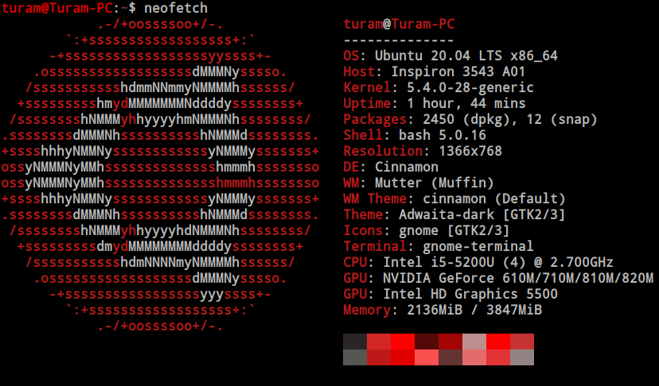

Ubuntu Debian altyapısı kullanan ve 2004 yılından beri geliştirilen bir GNU/Linux işletim sistemidir. Teknik bilgisi olsun, olmasın herkesin gönül rahatlıyla kullanabileceği bir linux dağıtımı olan Ubuntu'nun her dört yılda bir LTS(Long Term Support - Uzun Dönem Destek) sürümü yayınlanmaktadır ve en güncel sürümü 23 Nisan 2020 tarihinde yayınlandı.

GNU/Linux evrenine ilk tanışmam Ubuntu ile gerçekleşmişti. Gerçekten kullanımı ve alışması kolay, donanımı kolay tanıyabilen ve işlem yapmanın oldukça kolay olduğu bir dağıtım olduğunu belirtmek isterim. Zaten "Linux for human beings (İnsanlar için Linux)" sloganı ile öne çıkan Ubuntu'nun her kesimden kullanıcıya rahat bir kullanım sağladığı aşikardır.

Ubuntu 20.04 sürümünün yayınlanmasıyla hemen kurdum ve sizler için gözlemlerimi listeliyorum;

 - **Dark Mode:** Yeni sürüm ile birlikte Dark Mode GNOME arayüzüne varsayılan olarak eklenmiş. Bu sayede ek paket ya da tema indirmeksizin dark mode ile arayüzü kullanabilirsiniz.

- **Donanımı Artık Daha İyi Tanıyor:** 18.04 sürümünü kullandığım zamanlar NVIDIA GeForce 820m ekran kartımı tanıtabilmek için ek kurulumlar yapmam gerekiyordu. Bu sürümde kurulum tamamlandıktan sonra ekran kartımın sürücülerinin yüklendiğini ve sorunsuz bir şekilde sistemin tanıdığını gözlemledim.

- **Optimizasyon İyileştirmesi:** 18.04 sürümünde sistem açıldığında yaklaşık 950 MiB hafıza kaplarken bu sürümde 820 MiB bandına kadar indiğini gözlemledim. Elbette bu sadece Ubuntu ile gelen bir durum değil. GNOME ve daha birçok yazılımında sürümleri yükseltilerek bu durumun sağlandığından eminim.

- **Zarif Grafiksel Arayüz:** Normal şartlarda GNOME kullanmayı pek sevmeyen birisiyim ve asıl tercihim Cinnamon'dur. Ancak GNOME'un yeni sürümü ile birlikte ikon ve fontların çok daha zarif ve göze hitap eden bir yapıya sahip olduğunu belirtmeden geçemem.

Genel itibariyle Ubuntu 20.04 beni fazlasıyla memnun eden bir başlangıç yaptığını söyleyebilirim. Eğer ki sizlerde Linux kullanmak istiyor ama bir türlü alışamayacağınızı düşünüyorsanız Ubuntu 20.04'ü kullanmanızı kesinlikle tavsiye ediyorum.

Özgür yazılımın gücü ile kalın...

Ubuntu'yu İndirmek İçin -> https://ubuntu.com/download/desktop

DistroWatch Ubuntu Sayfası -> https://distrowatch.com/table.php?distribution=ubuntu
