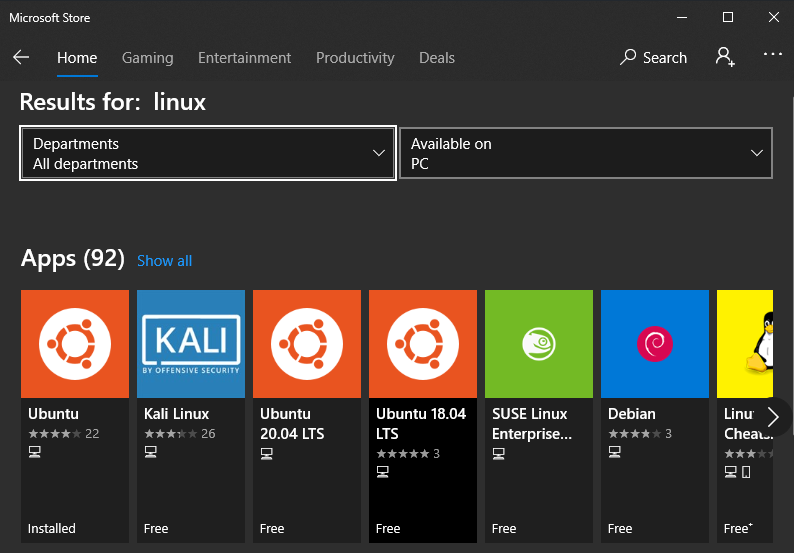
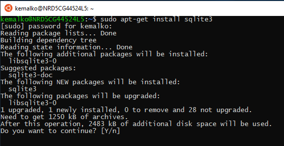
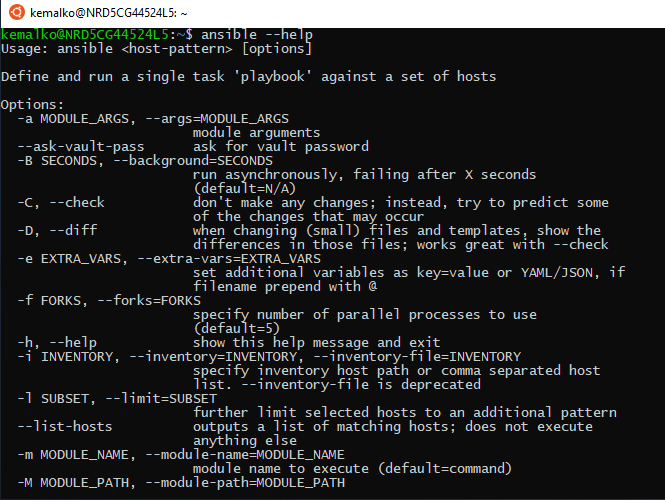

Kendimi Windows platformundan soyutlamış ve Linux dünyasına daha fazla adapte etmiş bir durumdayım. Bu yüzden işyerinde kullandığım Windows makine içerisinde Linux kullanabilmenin yollarını araştırdım. Eriştiğim çözümleri sizler için derliyorum.

## 0. Yöntem - Sanal Makine

Belki de en çok bilinen ve yaygın olarak kullanılan yöntem windows içerisinde VMWare ya da VirtualBox gibi yazılımlar ile sanal makine oluşturmak ve onun üzerinden Linux komutları çalıştırmaktır. Ancak bu yöntem özellikle düşük özellikli donanım parçalarına sahip kişilerin korkulu rüyası olabilir. Aynı zamanda bu işlem her ne kadar Windows makinenin içerisinde gerçekleşse bile doğrudan Windows'da yer alan dosyaları ve programları kullanabilmemize engel olmaktadır.

O yüzden diğer yöntemleri denemenizi tavsiye ederim.

## 1. Yöntem - PowerShell

PowerShell Microsoft tarafından cmdlet'ten farklı olarak Windows Shell'ini .NET Framework çatısında kullanan, kendine has syntax'a, komutlara ve özelleklere sahip bir CLI programdır.

PowerShell üzerinden bash komutları çalıştırabilmemiz için gerekli olan komut `bash.exe`'dir. Kısaca `bash` yazarak bu komutları çalıştırabiliriz.

**Örn:**

**vi** komutu Unix/Linux sistemlere özel bir terminal text editördür. Windows'ta terminal üzerinde alternatifleri için ek kurulum yapmak gerekmektedir. Hızlıca terminal üzerinde dosyada değişiklik yapmak için aşağıdaki komut kullanılabilir.

``` PowerShell
bash -c "vi config.yml"
```

Ayrıca komut satırına yalnızca `bash` yazarsanız bash terminaline geçiş yaparsınız. Bu sayede `bash -c` eklemeksizin linux komutlarını çalıştırabilirsiniz.

**Örn:**

``` PowerShell
PS C:\Users\kemalko> bash
kemalko@NRD5CG44524L5:/mnt/c/Users/kemalko$
kemalko@NRD5CG44524L5:/mnt/c/Users/kemalko$ cd NewFolder
kemalko@NRD5CG44524L5:/mnt/c/Users/kemalko/NewFolder$ ll
total 8
drwxrwxr-x 2 kemalko kemalko 4096 May 13 12:37 ./
drwxrwxr-x 9 kemalko kemalko 4096 May 13 12:37 ../
kemalko@NRD5CG44524L5:/mnt/c/Users/kemalko/NewFolder$
```

## 2. Yöntem - Windows Subsystem for Linux

PowerShell üzerinde yaptıklarımız yalnızca bash komutları ile kısıtlıdır. Ancak WSL sayesinde seçtiğimiz distronun paketlerine erişebilir ve makinemize kurabiliriz.

Microsoft Store içerisinden favori dağıtımınızı seçerek kurabilirsiniz.



İstediğiniz paketi indirebilirsiniz.



Windows'da çalışmayan Ansible gibi yazılımları WSL ile Windows'da kullanabilirsiniz.



**Windows Subsystem for Linux** başlı başına bir blog yazısı olabilecek derin bir konu olduğunu fark ettim ve bu yüzden yalnızca yazının amacına odaklanarak olabildiğince bu yazı içerisinde sözü çok uzatmaksızın sizinle detayları paylaşmayı hedefledim. Umarım listelediğim çözümler sizinde işinize yarar.

Özgür yazılımın gücü ile kalın...

---

Detaylı bilgi için

- [https://en.wikipedia.org/wiki/Windows_Subsystem_for_Linux](https://en.wikipedia.org/wiki/Windows_Subsystem_for_Linux)
- [https://docs.microsoft.com/en-us/windows/wsl/](https://docs.microsoft.com/en-us/windows/wsl/)