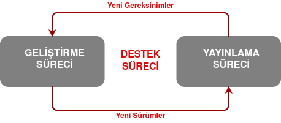

Belki ilk kez bir yazılım geliştirmek üzere bir teklif almışsınızdır, ancak ne yapmanız gerektiğini ve nasıl başlayacağınızı bilmiyorsanız bu yazım tamamen sizler için.

Bu yazımda olabildiğince az teknik detay paylaşarak yazılım projesi geliştirmeye yeni başlayacak arkadaşlara tavsiyelerde bulunmak istiyorum. Bu tavsiyelerin büyük çoğunluğu benim zamanında yaptığım hatalardan aldığım dersleri kapsamakla birlikte iş hayatındaki insanların yazdıkları ve belirttikleri durumları da içinde barındırmaktadır.

Yazılım geliştirmek zorlu süreçlerdir ve bu süreçleri yönetebilmek bazen hiç göründüğü kadar kolay olmamaktadır. Özellikle ilk defa proje geliştirmek üzere hevesle masanın başına oturan kişilerin belli bir süre sonra çok sayıda hata ile boğuştuğu ve en sonunda pes ederek bu işten vazgeçtiğini çokca gözlemledim. Lafı hiç uzatmadan listeye kendi hayali senaryom ile göz atalım.

>**Bir yazılım geliştirmek üzere teklif almış birisiniz. Bu yazılım için belli bir ücret ve zaman kriterlerinde anlaştınız. Çalışmaya başlamak üzere masanıza geçtiniz.**

## Geliştirme Süreci
Unutulmamalıdır ki yazılım geliştirmek aslında bir süreç yönetimidir. Geliştirmekten test etmeye, canlıya almaktan destek vermeye kadar uzanan ve sürekli kendini tekrar eden bir süreçler zinciridir. Bu süreçlerin nasıl yönetileceği elbette tartışmaya açık bir konudur. Dünya'nın dev firmaları bile tek bir süreç yönetimi üzerine odaklanmaz ve herkes aynı yöntemi uygulayamaz. Ancak siz bu projeyi tek başınıza geliştireceğiniz için elbette ilk olarak kendi metodolojinizi belirlemeniz ve profesyonel metodolojilerden örnekleri inceleyerek kendi yönetimizle işi yönetebilirsiniz.

**Örnek Yöntem:** Yapacağınız işi parçalara bölerek bu süreci yönetebilirsiniz. Nasıl mı? Aşağıdaki görmüş olduğunuz diagramı takip ederek.

### 1-) Planlama
Bir işi parçalara bölmek iş geliştirme süreçlerinde en çok kullanılan yöntemlerdendir. Bu yöntem o kadar etkilidir ki algoritmalarda da kullanılmıştır. **(Örn: Merge Sort Algorithm - Birleştirmeli Sıralama Algoritması)** Geliştirilecek olan yazılım ne olursa olsun, hangi platformda  ve hangi dille yayınlanacaksa yayınlansın yapılacak işi parçalara bölerek yapmanızı  tavsiye ederim.

Bu yazılım verilerle mi çalışacak, ne yapacak, bir uç nokta ile haberleşecek mi? Bu ve bunun gibi sorular için aslında cevap istenilen iş ile alakalıdır. Eğer ki müşteri sizden bir blog sitesi istiyorsa ona kolayca yazı girebileceği bir portal yapmanız, yazdığı yazıları bir veritabanında ya da dosyada saklamanız, kullanıcıya görüntülenmesi için bir arayüz oluşturmanız ve bu arayüzde verileri göstebilmeniz gerekli. 

Bir Blog Sitesi geliştireceğiz. Bu senaryoya göre planlamanın alt maddelerine göz atalım;

1. **Parçayı Belirle:** Bir yazar arayüzü oluşturarak yazıların sorunsuzca girilebilmesini sağlamalıyız. Bu arayüze kullanıcı adı ve şifre ile girilmeli. Yazılan yazılar bir veritabanında saklanmalı. Yazıların **'Rich Text Editor'** kullanılarak daha çarpıcı ve etkileyici gözükmesi sağlanmalı. Anasayfada bu yazılar veritabanından çekilip listelenmelidir.

>Sadece bu maddede bile kafamızdaki plan oluşmaya başladı ve yapılacaklar listesi belirlendi. Ancak tek başına bu maddeler pek iş görmemektedir. O yüzden bir sonraki maddeye göz atalım;

2. **Gereksinimleri Tespit Et:** Bir yazılım dilinde yeterli kadar bilgi birikinime sahibiz. Ancak bu dili kullanabilmek için hangi yazılım, kütüphane ya da platforma ihtiyacımız var? Bildiğimiz bir dil ile mi geliştirmeliyiz, yoksa böyle bir proje için en uygun dili mi seçmeliyiz? Böyle bir proje için en uygun dil hangisi? Bir veritabanı kullanacağız ve bu veritabanı kullanacağımız dille uyumluluk sağlıyor mu? Dilin seçtiğimiz veritabanına uygun sağlayacısı var mı? Kullanacağımız veritabanı saklayacağımız veriler için uygun mu?

>Gereksinim analizi en az ilk maddede olduğu kadar önemli ve aslında projenin inşasında kullanılacak gerekli bütün bileşen, materiyal vb. şeylerin belirlendiği kısımdır. Unutulmamalı ki yazılım geliştirmek bir iştir ve kullandığımız dil bizim işi yaparken kullandığımız alettir.

3. **Süreyi Belirle:** Elbette bu projeyi geliştirirken bunun için ne kadar zaman ayırmanız gerektiğini tespit etmeli ve bu zaman aralığına sadık kalarak projeyi gerçekleştirmelisiniz.

### 2-) Gereksinimleri Tamamlama
Bu aşamada artık kafamızdaki yol haritası büyük çoğunlukla belirlenmiş. Şimdi geliştirme ortamını oluşturma zamanı.

1. **Gereksinimi Elde Et:** Adından da anlaşılacağı üzere artık gereksinimlerimizi kurmamız gerekli. Örneğin veritabanı olarak **'MySQL'** kullanmayı seçtik ve bunun için geliştirme yapacağımız bilgisayara MySQL'i kurmamız gerekmektedir.

2. **Uygun Geliştirme Ortamını Hazırla:** Kullanacağımız IDE'den tutun proje içerisinde yer alacak kütüphaneleri bile hazırlamamız ve geliştirme anında yaşanabilecek ortam sorunlarını minimize etmek için en uygun aşama bu aşamadır.

### 3-) Geliştirme
Bu aşama tamamen teknik bir kısımdır. Kullanılan dilin uygun kod yazım standartlarından, tasarım desenleri olmak üzere çok geniş yelpazede konunun yer aldığı ve bir blog yazısında anlatılamayacak kadar önemli bir kısımdır.

Ancak burada gelişme aşamasında yaşanan bazı durumlara değinecek olursak liste şu şekilde;

1. **Mükemmelliyetçi Olmayın:** Kodları yazarken kesinlikle mükemmeliyetçi olmayın. Bu sizi yıpratır ve uzun bir süre zarfında yaptığınız işten sizi soğutmaya kadar götürür. Ancak elbette ki **'Spagetti Code'** yazmayın. Yazdığınız kodların çalıştığından emin olduktan sonra elinizden geldiğince düzenlemeye ve tasarım desenlerine sadık kalmaya çalışın.

2. **Sürüm Kontrol Sistemi Kullanın:** Kod satırları ve dosya sayısı sürekli artacak. Bu zaman zarfında değişikliklerinizi gözden geçirmek ve yedeklemek sürekli zorlaşacak. Bu yüzden Özellikle **'Git'** olmak üzere diğer sürüm kontrol sistemlerini kullanmayı ihtmal etmeyin.

3. **Örnek Projeleri İnceleyin:** Açık kaynak kodlu projelerin sayısı her geçen gün kat ve kat artmakta. Yapmış olduğunuz çalışma boyunca örnekler toplamayı ve onları gözlemlemeyi ihmal etmeyin.

4. **Google'ı Etkili Kullanın:** Yazılım geliştirirken hatalar ya da çıkmazlarla karşılaşacaksınız. Sorunlarınızı mutlaka internette aratmayı ve cevabı ilk etapta sormak yerine araştırmanızı tavsiye ederim.

5. **Planınıza Sadık Kalın:** En baştaki yaptığınız plan ne kadar iyiyse geliştirme aşamasında ilerlemeler bir o kadar kolaylaşacaktır. Planınıza sadık kalmayı ve onun üzerinden geliştirmeyi sürdürmeyi olabildiğince devam ettirin.

6. **Hata Yapmaktan Korkmayın:** Hatasız yazılım geliştirmenin neredeyse mümkün olmadığını unutmayın. Karşılaştığınız hataların miktarı sizi yorsada mutlaka karşılaşılan hatanın bir çözümü bulunur. İnternetten hataların nedenini araştırmayı ihmal etmeyin.

7. **Geliştirdiğiniz Ortamı Verimli Kullanın:** Proje geliştirirken bir IDE kullanıyorsanız mutlaka onun neler yapabildiğini ve onun bu süreçte size ne gibi yardımları olabileceğini araştırın.

8. **Yorum Satırları Hayat Kurtarır:** Yazılım geliştirirken karşılaşılan en büyük sorunlardan biriside ilerleyen süreçte daha önceden yazılan kodların ne için yazıldığını tam olarak hatırlayamamaktır. Kulağa her ne kadar saçma gelsede geliştiriciler belirli bir zaman sonra yazdıkları kodların ne işe yaradığını unutabiliyor. Bu çok olağan bir durum olup en iyi çözüm elbetteki yorum satırları ile o kodların ne iş yaptığını yazmaktır. 

### 4-) Test Et
Geliştirdiğimiz yazılımın isterlere uygun bir şekilde çalıştığını ya da çalışmadığını tespit etmek için bu aşama gereklidir. Müşteriye proje teslim edilmeden önce isterlerin tamamını test edilerek doğrulanmalıdır.

1. **Karşılaştığınız Hataları Giderim:** Geliştirme aşamasında da belirttiğim gibi hatalar karşınıza çıkacaktır. Bunları tespit edin ve hataları giderin. Unutmayın, yazılımı siz geliştirdiniz ve nerelerde hata ile karşılaşabileceğinizi öngörebilirsiniz. 

2. **İşlevleri Değerlendirin:** Bütün parçalar geliştirilip bir araya getirildiğinde bu parçaların birbiri ile uyumunu değerlendirin ve gerekli durumlarda müdahele etmekten kaçınmayın.

3. **Çalıştığından Emin Olun:** Bazı kısımlar öyledir ki beş farklı durumda düzgün çalışırken altıncı durumda sorun çıkartabilir. Bu yüzden karşılaşabileceğiniz bütün senaryoları derleyerek geliştirdiğiniz parçaların çalıştığından emin olmadan testleri sonlandırmayın.

4. **Sabırlı Olun:** Belki çok basit bir hata ile defalarca karşılaşabilirsiniz. Ya da sürekli aynı şeyi denemenize rağmen bir türlü doğru çıktıyı elde edemeyebilirsiniz. Bu noktada sabırlı olmak en önemli unsurdur. Tekrar tekrar aynı testi yapmaktan korkmayın.

5. **Başkalarından Yardım Alın:** Başka bir bakış açısı belki en başında öngöremediğiniz bir sorunu tespit edebilmenizi ve gerekli düzenlemeleri yapmanızı sağlayabilir. Her ne kadar senaryolarınız belirgin olsa bile koca bir olasılıklar havuzunda olduğunuzu ve başka durumlar ile karşılaşabileceğinizi unutmayın.

6. **Farklı Test Yöntemlerini Keşfetin:** Test yapmak koca bir meslek grubunun işidir. Yazılım testleri üzerine yazılmış yüzlerce makale, geliştirilmiş tonlarca metodoloji bulunmaktadır. Geliştirdiğiniz yazılımı test ederken bu metodolojileri araştırmayı ve farklı yöntemler kullanarak test sürecini tamamlamaktan kaçınmayınız.

Yazılım geliştirme süreci en başta bahsettiğim gibi zor bir süreçtir. Ancak aşamaların hepsini başarıyla tamamladıysanız bunun verdiği özgüven ile kendinizle gurur duyabilir ve projeyi teslim etmek için hazırlanabilirsiniz :).

## Destek Süreci
Artık projede ikinci aşamaya geçmiş bulunmaktasınız. Bundan sonraki süreç aslında içerisinde ilk süreci kapsamaktadır. Yani yazılım geliştirme süreci neredeyse sonu gelmeyen bir süreçtir.  Bir projenin sonlanması elbette arz-talep ile ilişkilidir. Eğer projenin yeni isterleri oluşuyor ise proje artık bu sonsuz döngüye girmeye hazırdır.

Bu süreç aslında daha çok benim mesleğim olan **'DevOps Mühendisliği'** ile ilişkilendirilir. Ancak unutulmamalı ki bir yazılım projesinin her adımında biz DevOps Mühendislerinin müdahele ve desteğine ihtiyaç duyulur.

Bu sürecin detaylarını başka bir yazıda paylaşacağım ancak son olarak müşteriye projeyi teslim etmek ve yazılımı canlıya alma üzerine konuşmalıyız.

### Yazılımı Canlıya Alma
Artık yazılım isterleri karşılıyordur ve müşteri ya da ziyaretçilerine kullanıma açılabilir. Senaryomuzda bir blog sitesi geliştirdik ve bu site elbette bir hosting üzerinde yayınlanmalı ve bir domain ile kullanıcılara sunulmalı.

>**Lütfen bu kısma geçtiğinizde öncelikli olarak geliştirdiğiniz dilde projeyi yayınlamanın nasıl mümkün olduğunu araştırınız.**

>Örn: "Deployment Node.JS Application", "How to Deploy ASP.NET Core Application" diye internette aratarak geliştirdiğiniz dildeki adımları takip ediniz.

**Hosting**

1. **Paylaşımlı Hosting:** İnternette 'Paylaşımlı Hosting' diye arattığınızda karşınıza yüzlerce hosting sağlayıcı firma çıkacaktır. Hiçbir hosting firmasının reklamını yapmak istememekle birlikle hangisinin en iyisi olduğu bir tartışma konusudur. Burada kendinize uygun bulduğunuz bir hostingi satın alarak projenizi canlıya alabilirsiniz.

>Paylaşımlı Hostingler ağırlıklı olarak .NET ve PHP bazlı diller ile geliştirilmiş projeleri destekler. Eğer başka bir dil ile geliştirdiyseniz paylaşımlı hosting bulma ihtimaliniz oldukça azalmaktadır.

2. **Self-Hosted:** Bir sanal sunucu kiralayarak sistemin bütün gereksinimlerini siz kurarak bu projeyi canlıya alabilirsiniz. Ancak belirtmeliyim ki sadece projenin sorunları ile değil sunucunun sorunlarıyla da uğraşmanız gerekmektedir. (**Örn:** Güvenlik zafiyetlerinin kapatılması, servislerin otomatize edilmesi, sistemin uyumluluğu vb.) Aynı zamanda self-hosted için kiralayacağınız sunucunun ücretinin paylaşımlı hostinge göre daha pahalıya mal olacağını unutmayın.

**Domain**

Domain (Alan Adı) satın almayı tıpkı hostingde anlattığım gibi internetten aratarak bir çok domain sağlayıcı firmayı görüntüleyebilir ve kendi tercihinize uygun bir firmadan satın alabilirsiniz.

## Son Söz
Eğer ki yazının tamamını okuduysanız aslında bir yazılım geliştirme süreci metodoloji olan **'Agile - Çevik Metodoloji'** sinin bir uygulamasını öğrendiğiniz. Özellikle kalın yazdığım teknik başlıkları internetten araştırmanızı tavsiye ederim. Çünkü anlattığım her şeyi bir kenara bırakırsak size asıl tavsiye etmek istediğim şey **Araştırma** dır. Merak ettiğiniz ve karşınıza çıkan her konuyu usanmadan araştırıp onun hakkında bilgi edinirseniz bu sizi başarıya götürecek en önemli adımlardan birisi olur.

Kendini yazılım geliştirme konusunda geliştirmek isteyenler için son tavsiyem linkteki projeyi incelemeleri ve hangi alanda çalışmak istediklerini bu yol haritasını inceleyerek karar vermeleridir. 

**Link ->** [Kamranahmedse/Developer-Roadmap](https://github.com/kamranahmedse/developer-roadmap)

En kısa sürede Destek Süreci ve DevOps Mühendisliği ile alakalı yazımı yazacağım.

Yeni yazılarda görüşmek üzere...

Yazılımla Kalın :)

---
Manşet Görseli UnDraw'dan alınmıştır -> [https://undraw.co/illustrations](https://undraw.co/illustrations)